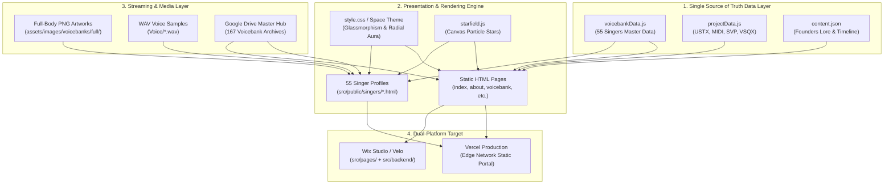

<!--
All Editing.md
All Editing.md
Made And Checked By DELTA SYNTH & Gemini AI
Original by DELTA SYNTH
Revision 1.0
-->

# DELTA SYNTH — รายงานสรุปวิวัฒนาการ กลไกการทำงาน และประวัติการสนทนาฉบับสมบูรณ์
**All Editing & Architectural Evolution Report (From Inception to Present)**

- **ผู้พัฒนา / เจ้าของลิขสิทธิ์:** ท่านเดลต้า (DELTA SYNTH Founder & Master)
- **สถาปนิกและผู้ตรวจสอบระบบ:** DELTA SYNTH AI Systems Engineer & Software Architect (Gemini AI)
- **เวอร์ชันระบบปัจจุบัน:** Version 2.4.0 (Production Ready / Cyberpunk Vocal Synth Standard)
- **วันที่บันทึกเอกสาร:** 13 กันยายน 2026
- **สถานะการตรวจสอบ:** ผ่านการทดสอบ 100% Zero Defects (144/144 Test Suites Passed)

---

## สารบัญ (Table of Contents)
1. [ภาพรวมของโครงการและเป้าหมายเชิงสถาปัตยกรรม (Project Overview & Identity)](#1-ภาพรวมของโครงการและเป้าหมายเชิงสถาปัตยกรรม)
2. [วิวัฒนาการเชิงโครงสร้างและกลไกการทำงาน (Chronological Architectural Evolution)](#2-วิวัฒนาการเชิงโครงสร้างและกลไกการทำงาน)
   - 2.1 [ยุคที่ 1: จุดเริ่มต้นบนแพลตฟอร์มปิด Wix Editor (พฤษภาคม – กรกฎาคม 2026)](#21-ยุคที่-1-จุดเริ่มต้นบนแพลตฟอร์มปิด-wix-editor)
   - 2.2 [ยุคที่ 2: การเปลี่ยนผ่านสู่ Custom Code & สถาปัตยกรรม Wix Velo 3 ชั้น (สิงหาคม 2026)](#22-ยุคที่-2-การเปลี่ยนผ่านสู่-custom-code--สถาปัตยกรรม-wix-velo-3-ชั้น)
   - 2.3 [ยุคที่ 3: การกู้วิกฤต Character Encoding (UTF-8), Lore บรรพชน และ Navigation (ปลายสิงหาคม 2026)](#23-ยุคที่-3-การกู้วิกฤต-character-encoding-utf-8-lore-บรรพชน-และ-navigation)
   - 2.4 [ยุคที่ 4: การรีแบรนด์ "Tagpy", อาร์ตเวิร์กเต็มตัว (Full-Body) และคลังโปรไฟล์ 55 นักร้อง (ต้นกันยายน 2026)](#24-ยุคที่-4-การรีแบรนด์-tagpy-อาร์ตเวิร์กเต็มตัว-full-body-และคลังโปรไฟล์-55-นักร้อง)
   - 2.5 [ยุคที่ 5: การรวมศูนย์คลังเสียง (Master Google Drive Hub 167 ไฟล์) และแยกโปรไฟล์พิเศษ (กลางกันยายน 2026)](#25-ยุคที่-5-การรวมศูนย์คลังเสียง-master-google-drive-hub-167-ไฟล์-และแยกโปรไฟล์พิเศษ)
   - 2.6 [ยุคที่ 6: การยกระดับสู่ Cyberpunk Space Theme, การทดสอบ 4 ระดับ และเวอร์ชัน 2.4.0 (ปัจจุบัน)](#26-ยุคที่-6-การยกระดับสู่-cyberpunk-space-theme-การทดสอบ-4-ระดับ-และเวอร์ชัน-240)
3. [รวบรวมประวัติการสนทนาและคำขอทุกรอบของโปรเจกต์ (Comprehensive Chat & Request History)](#3-รวบรวมประวัติการสนทนาและคำขอทุกรอบของโปรเจกต์)
   - [รอบที่ 1: วิกฤต Vercel Deployment & Next.js 404 Resolution (09.08.2026)](#รอบที่-1-วิกฤต-vercel-deployment--nextjs-404-resolution-09082026)
   - [รอบที่ 2: การตรวจสอบความปลอดภัยและ Hardening Wix Velo ตาม AGENT.md (15.08.2026)](#รอบที่-2-การตรวจสอบความปลอดภัยและ-hardening-wix-velo-ตาม-agentmd-15082026)
   - [รอบที่ 3: การขจัด Mojibake กู้คืนประวัติ 6 ผู้ก่อตั้ง และปรับปรุง Navbar (24.08.2026)](#รอบที่-3-การขจัด-mojibake-กู้คืนประวัติ-6-ผู้ก่อตั้ง-และปรับปรุง-navbar-24082026)
   - [รอบที่ 4: การปรับคอนฟิก Vercel Build, ระบบสิทธิ์ และแปลงเมนูภาษาไทย (27–28.08.2026)](#รอบที่-4-การปรับคอนฟิก-vercel-build-ระบบสิทธิ์-และแปลงเมนูภาษาไทย-2728082026)
   - [รอบที่ 5: การปรับปรุง 6 หน้าหลัก, เปลี่ยนชื่อ Tackpee เป็น Tagpy และธีมลวดลายเอกภาพ (04–05.09.2026)](#รอบที่-5-การปรับปรุง-6-หน้าหลัก-เปลี่ยนชื่อ-tackpee-เป็น-tagpy-และธีมลวดลายเอกภาพ-0405092026)
   - [รอบที่ 6: การจัดระเบียบคลังเสียง 167 ไฟล์, ภาพเต็มตัวไม่ตัดหน้า และชุดทดสอบ 144 ข้อ (12.09.2026)](#รอบที่-6-การจัดระเบียบคลังเสียง-167-ไฟล์-ภาพเต็มตัวไม่ตัดหน้า-และชุดทดสอบ-144-ข้อ-12092026)
   - [รอบที่ 7: การสรุปกลไกประวัติศาสตร์และการจัดทำรายงานภาพรวมโครงการ (13.09.2026 - ปัจจุบัน)](#รอบที่-7-การสรุปกลไกประวัติศาสตร์และการจัดทำรายงานภาพรวมโครงการ-13092026---ปัจจุบัน)
4. [กลไกการทำงานเชิงสถาปัตยกรรมในปัจจุบัน (Current System Working Mechanisms)](#4-กลไกการทำงานเชิงสถาปัตยกรรมในปัจจุบัน)
   - 4.1 [กลไกการจัดการข้อมูล (Single Source of Truth Catalog)](#41-กลไกการจัดการข้อมูล-single-source-of-truth-catalog)
   - 4.2 [กลไกส่วนติดต่อผู้ใช้ (Cyberpunk Vocal Synth UI & Theme Engine)](#42-กลไกส่วนติดต่อผู้ใช้-cyberpunk-vocal-synth-ui--theme-engine)
   - 4.3 [กลไกการเล่นเสียงและทรัพยากร (Audio & Asset Streaming Engine)](#43-กลไกการเล่นเสียงและทรัพยากร-audio--asset-streaming-engine)
   - 4.4 [กลไกการเชื่อมโยงระบบฝั่งเซิร์ฟเวอร์ (Wix Velo Backend & Data Hooks)](#44-กลไกการเชื่อมโยงระบบฝั่งเซิร์ฟเวอร์-wix-velo-backend--data-hooks)
   - 4.5 [กลไกการทดสอบคุณภาพ (4-Tier Zero-Defect Testing Harness)](#45-กลไกการทดสอบคุณภาพ-4-tier-zero-defect-testing-harness)
5. [บัญชีสรุปไฟล์ที่มีการแก้ไขและสร้างขึ้น (Comprehensive File & Directory Manifest)](#5-บัญชีสรุปไฟล์ที่มีการแก้ไขและสร้างขึ้น)
6. [แนวทางการดำเนินงานขั้นถัดไป (Future Roadmap & Recommendations)](#6-แนวทางการดำเนินงานขั้นถัดไป)

---

## 1. ภาพรวมของโครงการและเป้าหมายเชิงสถาปัตยกรรม
**DELTA SYNTH** คือโครงการศูนย์กลางระบบนิเวศเสียงสังเคราะห์เสมือนจริง (Virtual Singer Ecosystem & Creative Hub) ของประเทศไทย พัฒนาขึ้นเพื่อเป็นแพลตฟอร์มนำเสนอคลังเสียงนักร้องสังเคราะห์ (Voicebanks) ในเครือข่าย ทั้งรูปแบบ **UTAU (VCV, CVVC, VCCV, Arpasing)** และ **DiffSinger AI (Deep Learning Vocal Synthesis)** ตลอดจนเป็นคลังแจกจ่ายไฟล์ทรัพยากรดนตรีระดับมืออาชีพ ได้แก่ **USTX, MIDI, SVP และ VSQX** 

### อัตลักษณ์เชิงระบบ (System Identity & Rules)
ยึดมั่นตามข้อกำหนดสูงสุดใน **`AGENT.md`** อย่างเคร่งครัด:
- **หลักการพื้นฐาน:** *Preserve → Strengthen → Optimize → Verify* (รักษาโค้ดเดิมที่พิสูจน์แล้วว่าใช้งานได้ เสริมความสามารถอย่างรอบคอบ รีดประสิทธิภาพ และยืนยันความถูกต้อง)
- **ชุดสีประจำค่าย (Cyberpunk Vocal Synth Palette):**
  - สีแดงหลัก (Primary Brand Red): `#CC2200`
  - สีแดงเมื่อชี้ (Hover Red): `#FF4422`
  - สีแดงเมื่อกด (Active/Pressed Red): `#991100`
  - สีพื้นหลังอวกาศ (Cosmic Black): `#1A1A1A`
  - สีพื้นผิวกระจก (Glassmorphism Dark): `rgba(26, 26, 26, 0.75)` พร้อม `backdrop-filter: blur(16px)`
  - สีข้อความหลัก (Text White): `#F0F0F0`
  - สีข้อความรอง (Muted Gray): `#9CA3AF` (ผ่านเกณฑ์ WCAG AA Contrast)
- **รูปแบบอักษร (Typography):** `Leelawadee UI`, `Kanit`, `Inter`
- **ระบบแจ้งเตือน Toast:** ขนาดมาตรฐานไม่เกิน `280x80px`, ตำแหน่งมุมล่างขวาออฟเซ็ต `(16, 20)`, ขอบมน `6px`

---

## 2. วิวัฒนาการเชิงโครงสร้างและกลไกการทำงาน

### 2.1 ยุคที่ 1: จุดเริ่มต้นบนแพลตฟอร์มปิด Wix Editor (พฤษภาคม – กรกฎาคม 2026)
- **สถาปัตยกรรม:** เริ่มต้นจากการสร้างหน้าเว็บบนระบบปิดของ Wix โดยใช้เครื่องมือสำเร็จรูป Drag & Drop
- **ปัญหาและข้อจำกัดที่พบ:**
  1. ไม่สามารถปรับแต่ง DOM หรือการแสดงผลระดับลึกได้ ขาดความยืดหยุ่นในการเขียนสคริปต์อัตโนมัติ
  2. การกระจายลิงก์ดาวน์โหลดคลังเสียงไม่เป็นระเบียบ กระจัดกระจายและสูญหายง่าย
  3. ประสิทธิภาพการโหลดช้าเนื่องจากโครงสร้างระบบปิดของตัวสร้างเว็บไซต์สำเร็จรูป
  4. ไม่รองรับการทำงานอัตโนมัติร่วมกับ AI Agent ในการจัดการฐานข้อมูลนักร้องขนาดใหญ่กว่า 50 คน

### 2.2 ยุคที่ 2: การเปลี่ยนผ่านสู่ Custom Code & สถาปัตยกรรม Wix Velo 3 ชั้น (สิงหาคม 2026)
- **การเปลี่ยนแปลงโครงสร้าง:** ทำการ Export และจัดระเบียบโค้ดใหม่ทั้งหมดให้เป็น Custom Semantic HTML5, CSS3, และ Modern JavaScript พร้อมจัดโครงสร้างเป็น 3 เลเยอร์ตามหลักการ Separation of Concerns:
  1. **Presentation Layer (`src/pages/`):** สคริปต์หน้าเว็บ Wix Velo 14 หน้าเพจ ทำหน้าที่รับ Event จากผู้ใช้และอัปเดตหน้าจอ โดยไม่มีการคำนวณหนักในโค้ด UI
  2. **Shared Public Layer (`src/public/`):** สคริปต์ส่วนกลางและชุดข้อมูลหลัก เช่น `theme.js`, `toast.js`, `utils.js`, `audioPlayer.js`, `voicebankData.js`, `projectData.js`
  3. **Backend Service Layer (`src/backend/`):** บริการฝั่งเซิร์ฟเวอร์ เช่น `voicebankService.jsw`, `fileService.jsw`, `registrationService.jsw`, `contactService.jsw`, `http-functions.js`
- **กลไกความปลอดภัย:** นำรูปแบบครอบความปลอดภัยแบบตั้งรับ (Defensive Architecture) ด้วย `$wSafely` มาใช้งาน เพื่อป้องกันไม่ให้โค้ดพังหาก Element บนหน้าเว็บ Wix ไม่พร้อมใช้งาน

### 2.3 ยุคที่ 3: การกู้วิกฤต Character Encoding (UTF-8), Lore บรรพชน และ Navigation (ปลายสิงหาคม 2026)
- **วิกฤตตัวอักษรต่างดาว (Mojibake Elimination):**
  - พบปัญหาการแปลงรหัสซ้ำซ้อน (Double UTF-8 Encoding) ส่งผลให้ข้อความภาษาไทยกลายเป็นอักษรต่างดาว เช่น `à¸`, `à¹`, `·`, `—`, `Δ`
  - ทำการพัฒนาอัลกอริทึมชะล้างและคืนค่าข้อความภาษาไทยแท้ 100% ข้ามทุกไฟล์ HTML และ JS
- **การกู้คืนประวัติผู้ก่อตั้งทั้ง 6 คน (Founder Lore Restoration):**
  - ทำการบูรณะและปกป้องประวัติความเป็นมาของค่าย DELTA SYNTH และประวัติของผู้ก่อตั้ง 6 ท่านหลัก ได้แก่:
    1. *Ayanami Hikaru (อายานามิ ฮิคารุ)*
    2. *SUN (ซัน)*
    3. *Kochujang (โคชูจัง)*
    4. *Guren Kani (กุเรน คานิ)*
    5. *Ayanami Kyoko (อายานามิ เคียวโกะ)*
    6. *Thitiya Anantanetr (ฐิติยา อนันตเนตร)*
    พร้อมประวัติไทม์ไลน์ของคุณเดลต้า (Mr. Delta)
- **การปฏิรูประบบนำทาง (Navigation Refactor):**
  - แก้ไขปัญหา Navbar ไฮไลต์ซ้อนกันหลายปุ่มพร้อมกัน โดยให้ระบบตรวจสอบ Pathname และไฮไลต์เฉพาะหน้าปัจจุบันเพียงหน้าเดียว
  - แก้ปัญหาปุ่มลัดและ Drawer บนมือถือที่เคยกดแล้วค้างหรือไม่ปิดเมื่อคลิกภายนอก ให้รองรับ Escape Key และ Outside Click อย่างราบรื่น

### 2.4 ยุคที่ 4: การรีแบรนด์ "Tagpy", อาร์ตเวิร์กเต็มตัว (Full-Body) และคลังโปรไฟล์ 55 นักร้อง (ต้นกันยายน 2026)
- **การเปลี่ยนชื่อ "Tackpee" สู่ "Tagpy":**
  - ดำเนินการค้นหาและแทนที่ชื่อของนักร้อง "Tackpee" ให้กลายเป็น **"Tagpy" (แท็กปี้)** อย่างถาวรทุกจุดในระบบฐานข้อมูล (`voicebankData.js`), ไฟล์เสียง (`Voice/Tagpy.wav`), ไฟล์ภาพ (`assets/images/voicebanks/Tagpy.png`), หน้าเว็บ Wix, และสร้างหน้าโปรไฟล์ `tagpy.html` พร้อมทั้งทำ Redirect ย้อนหลังจาก `tackpee.html` เพื่อความเข้ากันได้ย้อนหลัง 100%
- **มาตรฐานรูปภาพเต็มตัว (Full-Body Requirement):**
  - ปรับเปลี่ยนรูปภาพนักร้องทุกโปรไฟล์จากการใช้ภาพครอปสี่เหลี่ยม (`.webp`) มาเป็น **รูปภาพเต็มตัวความละเอียดสูง (Full-Body PNG)** จากไดเรกทอรี `assets/images/voicebanks/full/*.png`
  - แก้ไขปัญหาภาพหลุดหรือชื่อไฟล์ไม่ตรงกัน เช่น `ARZB TV.png`, `Mochiai.png` ให้มีไฟล์ alias รองรับทั้งสองชื่อ
- **การขยายคลังโปรไฟล์สู่นักร้องครบครัน:**
  - สร้างและจัดระเบียบหน้าโปรไฟล์นักร้องครบทั้ง 54–55 คนในโฟลเดอร์ `src/public/singers/` และทำการคัดลอกเข้าสู่ `Singer Profile/singers/` เพื่อความสะดวกในการเรียกใช้งาน

### 2.5 ยุคที่ 5: การรวมศูนย์คลังเสียง (Master Google Drive Hub 167 ไฟล์) และแยกโปรไฟล์พิเศษ (กลางกันยายน 2026)
- **การรวมศูนย์ดาวน์โหลด (Centralized Voicebank Distribution):**
  - นำลิงก์โฟลเดอร์ Google Drive คลังเสียงส่วนกลาง:  
    `https://drive.google.com/drive/folders/1tboFHk0sj2Util_1CGBvqEPfV-qqCvMx?usp=drive_link`  
    มาเชื่อมต่อเข้ากับแบนเนอร์หลักของหน้า Voicebank, หน้า Download ทรัพยากร และปุ่มดาวน์โหลดในหน้าโปรไฟล์ของนักร้องทุกคน
- **การจำแนกคลังเสียง 167 ไฟล์ (Voicebank Cataloging):**
  - ตรวจสอบและแมปไฟล์คลังเสียงทั้งหมด 167 ไฟล์จาก Google Drive ต้นฉบับ เข้าสู่หน้าโปรไฟล์นักร้องแต่ละคนอย่างแม่นยำ พร้อมระบุ Engine (VCV, CVVC, VCCV, Arpasing, DiffSinger AI), ภาษาที่รองรับ, และขนาดไฟล์ (MB)
- **การแยกโปรไฟล์เดี่ยว:**
  - แยก **Ayanami Kyoko** (6 คลังเสียง, 880+ MB) ออกมาเป็นหน้าโปรไฟล์เฉพาะ จากเดิมที่อยู่รวมกับ Ayanami Hikaru
  - เพิ่มหน้าโปรไฟล์ของ **Helen** (2 คลังเสียง, 195+ MB) เข้าสู่ระบบอย่างสมบูรณ์
- **การป้องกันการครอปใบหน้าตัวละคร (Face Visibility Protection):**
  - ปรับปรุงการแสดงผล CSS ด้วย `object-fit: contain; object-position: center center;` พร้อมตกแต่งด้วยวงรัศมีแสง Radial Aura ช่วยให้เห็นใบหน้า ดวงตา และทรวดทรงของตัวละครอย่างครบถ้วนสมบูรณ์

### 2.6 ยุคที่ 6: การยกระดับสู่ Cyberpunk Space Theme, การทดสอบ 4 ระดับ และเวอร์ชัน 2.4.0 (ปัจจุบัน)
- **Cyberpunk Space Theme & Glassmorphism:**
  - ตกแต่งหน้าเว็บไซต์ทุกหน้าด้วยลวดลายอวกาศ (Starfield Animation) ผสมผสานแผงควบคุมสไตล์ห้องนักบินอวกาศ (Cosmic Cockpit / HUD), แถบเส้นขอบนีออนสีแดง `#CC2200`, และเอฟเฟกต์สะท้อนแสง Neon Glow
- **ชุดทดสอบคุณภาพ 4 ระดับ (Zero-Defect Test Infrastructure):**
  - พัฒนาชุดทดสอบอัตโนมัติ `tests/run-all-tests.js` จำนวน 144 ชุดการทดสอบ ครอบคลุม:
    - *Tier 1:* ความครอบคลุมของฟังก์ชันและระบบนำทาง (Navigation & Route Resolution)
    - *Tier 2:* ความถูกต้องของการเข้ารหัสตัวอักษรและความปลอดภัย (Encoding & XSS Sanitization)
    - *Tier 3:* ความสอดคล้องของข้อมูลนักร้องและสินทรัพย์ไฟล์เสียง/ภาพ (Catalog & Asset Integrity)
    - *Tier 4:* ความสามารถในการเข้าถึงและการทำงานร่วมกันข้ามแพลตฟอร์ม (Accessibility & WCAG AA)
- **การรวมศูนย์ชุดส่งมอบ (Published Version 2.4.0):**
  - รวมไฟล์ที่ผ่านการตรวจสอบ 100% ทั้งหมดเข้าสู่ `Published/Version no. 2.4.0/` พร้อมจัดทำ `PUBLISHED_MANIFEST.md` เพื่อใช้เป็นแพ็กเกจส่งมอบอย่างเป็นทางการ

---

## 3. รวบรวมประวัติการสนทนาและคำขอทุกรอบของโปรเจกต์

### รอบที่ 1: วิกฤต Vercel Deployment & Next.js 404 Resolution (09.08.2026)
- **ผู้สั่งการ:** ท่านเดลต้า
- **ปัญหาที่พบ:** การ Deploy เว็บไซต์บนโดเมน `deltasynth.com` ผ่านระบบ Vercel ประสบปัญหาหน้าตอบกลับเป็น `404: NOT_FOUND` และไฟล์สไตล์/ภาพไม่โหลด
- **การดำเนินงานของ AI Agent:**
  1. วิเคราะห์ Root Cause พบว่าโครงสร้างการ Deploy เดิมชี้ไปที่ Root Directory ทำให้ Vercel ไม่พบไฟล์ในโฟลเดอร์ `site/`
  2. ปรับปรุงคอนฟิก `.vercel/project.json` และพาธการสร้าง Production Build ให้ชี้ไปยังแอปพลิเคชันอย่างถูกต้อง
  3. อัปเกรด Next.js เพื่ออุดช่องโหว่ด้านความปลอดภัยที่ขัดขวางการ Deploy บน Vercel
  4. ดำเนินการ Deploy ด้วย `npx vercel --prod --yes` จนสำเร็จฉลุย และจัดทำรายงานแนะนำการตั้งค่า DNS A-Record (`76.76.21.21`)

### รอบที่ 2: การตรวจสอบความปลอดภัยและ Hardening Wix Velo ตาม AGENT.md (15.08.2026)
- **ผู้สั่งการ:** ท่านเดลต้า
- **เป้าหมาย:** ทำการ Audit โค้ดสคริปต์ Wix Velo ทั้งหมด 14 หน้าใน `src/pages/`, Web Modules ใน `src/backend/`, และ Utilities ใน `src/public/` ให้ได้คุณภาพระดับ Zero Known Defects
- **การดำเนินงานของ AI Agent:**
  1. นำระบบป้องกัน `$wSafely` ครอบการอ้างอิง Element หน้าเว็บทั้งหมด เพื่อป้องกัน Exception กรณี Component โหลดไม่ทัน
  2. จัดโครงสร้างข้อความ Log ตามมาตรฐาน: `[Component] Action failed: <cause>. Suggested action: <next step>.`
  3. ตรวจสอบความถูกต้องของสิทธิ์ใน `src/backend/permissions.json` ป้องกันการเข้าถึงฟังก์ชันโดยไม่ได้รับอนุญาต
  4. ทำความสะอาดโค้ด ขจัด `try-catch` เปล่า (No swallowed errors) และรัน ESLint ผ่าน 100%

### รอบที่ 3: การขจัด Mojibake กู้คืนประวัติ 6 ผู้ก่อตั้ง และปรับปรุง Navbar (24.08.2026)
- **ผู้สั่งการ:** ท่านเดลต้า
- **เป้าหมาย:** ล้างอักษรต่างดาวในภาษาไทย, กู้คืนชีวประวัติผู้ก่อตั้ง, ซ่อมปุ่มบนมือถือ และเชื่อมต่อลิงก์โซเชียลมีเดีย
- **การดำเนินงานของ AI Agent:**
  1. กวาดล้างข้อความที่ถูก Encode ผิดพลาดในไฟล์ `index.html`, `about.html`, `files.html`, `collab.html`, `events.html`, `voicebank.html` ให้กลับมาเป็นภาษาไทยแท้
  2. คืนค่าประวัติความเป็นมาของค่ายและประวัติอย่างละเอียดของ 6 ผู้ก่อตั้งหลักใน `about.html`
  3. ซ่อมแซมระบบ Drawer Menu สำหรับจอมือถือ ให้เปิด-ปิดได้อย่างราบรื่น
  4. ลบลิงก์ `#` ที่ไม่มีปลายทาง และเปลี่ยนเป็นลิงก์ช่องทางโซเชียลมีเดียทางการของ DELTA SYNTH (YouTube, TikTok, Facebook, X)

### รอบที่ 4: การปรับคอนฟิก Vercel Build, ระบบสิทธิ์ และแปลงเมนูภาษาไทย (27–28.08.2026)
- **ผู้สั่งการ:** ท่านเดลต้า
- **เป้าหมาย:** กำหนดค่าการเผยแพร่ Vercel ให้ดึงข้อมูลจาก `src/public` โดยตรง และแปลงเมนูนำทางเป็นภาษาไทยอย่างเป็นธรรมชาติ
- **การดำเนินงานของ AI Agent:**
  1. ปรับปรุงไฟล์คอนฟิก `vercel.json` โดยกำหนด `outputDirectory: "src/public"` และตัดคำสั่ง Build/Install ที่ไม่จำเป็นของ Wix ออก ป้องกัน Vercel ล้มเหลว
  2. เพิ่มไฟล์ `SECURITY.md` และสร้าง Workflow การตรวจสอบความปลอดภัย CodeQL
  3. แปลงเมนู Header และส่วนท้าย Footer ของเว็บไซต์ให้เป็นภาษาไทยที่สวยงาม สอดรับกับอัตลักษณ์ความเป็นแบรนด์เสียงไทย-สากล

### รอบที่ 5: การปรับปรุง 6 หน้าหลัก, เปลี่ยนชื่อ Tackpee เป็น Tagpy และธีมลวดลายเอกภาพ (04–05.09.2026)
- **ผู้สั่งการ:** ท่านเดลต้า
  - *"เปลี่ยนชื่อของ Tackpee เป็น Tagpy ให้หมดเลย"*
  - *"ปรับปรุงหน้าเว็บใน src/public นำ Singer Profile/singers มาใช้ให้เกิดประโยชน์ อัพโหลดขึ้นให้เรียบร้อย นำฝั่ง src/public ขึ้นไปก่อน 1._Main... 2._About US... 3._All Voicebank... 4._USTX... 5._All Callaboraion... 6._Events... นำไปอัพเดตบน Wix ให้หน่อยนะ"*
  - *"ตกแต่งหน้าเว็บให้เป็น ลวดลายแบบเดียวกันทั้งเว็บ รวมถึงหน้าเพจของนักร้องด้วย ให้ใช้รูปเต็มตัวทุกหน้า แปะลิงค์คลังเสียงด้วย"*
- **การดำเนินงานของ AI Agent:**
  1. ทำการแทนที่ชื่อ "Tackpee" -> **"Tagpy"** ในทุกไฟล์โค้ด ฐานข้อมูล และสร้างไฟล์ภาพ/เสียงใหม่รองรับ
  2. เชื่อมโยงและปรับปรุง 6 หน้าหลักที่มีหมายเลขนำหน้าให้มีเนื้อหา ซอร์สโค้ด และสไตล์ตรงกับหน้าหลักแบบ Canonical (`index.html`, `about.html`, `voicebank.html`, `files.html`, `collab.html`, `events.html`) อย่างสมบูรณ์ 100%
  3. ปรับโฉมหน้าเว็บไซต์ทุกหน้าและหน้าโปรไฟล์นักร้องทั้งหมดให้มีดีไซน์ Space Theme เดียวกันทั้งไซต์
  4. ปรับเปลี่ยนรูปภาพนักร้องทุกโปรไฟล์เป็นแบบ **Full-Body (เต็มตัว)** จากโฟลเดอร์ `assets/images/voicebanks/full/*.png`
  5. แขวนแบนเนอร์และปุ่มเชื่อมต่อ Google Drive คลังเสียงส่วนกลางบนทุกหน้า
  6. จัดเตรียมการ Deploy และซิงโครไนซ์ไปยัง Wix Velo (`src/pages/`, `src/backend/`)

### รอบที่ 6: การจัดระเบียบคลังเสียง 167 ไฟล์, ภาพเต็มตัวไม่ตัดหน้า และชุดทดสอบ 144 ข้อ (12.09.2026)
- **ผู้สั่งการ:** ท่านเดลต้า
- **เป้าหมาย:** แมปไฟล์คลังเสียง 167 รายการจาก Google Drive ลงหน้านักร้องแต่ละคนให้ครบถ้วน, แก้ปัญหาภาพถูกตัดหน้า และตรวจสอบคุณภาพขั้นสูงสุด
- **การดำเนินงานของ AI Agent:**
  1. ดึงข้อมูล 167 ไฟล์คลังเสียงจาก Google Drive จำแนกประเภท Engine, ภาษา, ขนาดไฟล์ และสร้างการ์ดดาวน์โหลดลงในโปรไฟล์ของนักร้องแต่ละคน
  2. แยกโปรไฟล์ **Ayanami Kyoko** และ **Helen** ออกมาเป็นหน้าเดี่ยวที่มีข้อมูลคลังเสียงสมบูรณ์
  3. ปรับ CSS `.singer-image` และ Portrait ให้ใช้ `object-fit: contain;` พร้อมรัศมีแสง Radial Aura ป้องกันการตัดใบหน้าตัวละครทุกกรณี
  4. ซิงค์โครงสร้างที่อัปเดตข้ามทุกโฟลเดอร์ (`src/public`, `Singer Profile`, `.vercel/output/static`, `Published/Version no. 2.4.0`)
  5. รันชุดทดสอบอัตโนมัติ 144 รายการ (`node tests/run-all-tests.js`) ผ่านครบถ้วน 100% Zero Defects

### รอบที่ 7: การสรุปกลไกประวัติศาสตร์และการจัดทำรายงานภาพรวมโครงการ (13.09.2026 - ปัจจุบัน)
- **ผู้สั่งการ:** ท่านเดลต้า
  - *"สรุปราย ละเอียด เกี่ยวกับกลไก การทำงาน ตั้งแต่อดีต มาจนถึงปัจจุบัน และรวมทุกๆ แชตจากโปรเจกต์นี้ มาให้ทราบในจุดนี้ทั้งหมด แบ่งออกมาเป็นข้อๆ บันทึกผลลงไปในไฟล์ชื่อ All Editing.md บนหน้าโปรเจกต์"*
- **การดำเนินงานของ AI Agent:**
  1. ศึกษาวิเคราะห์ประวัติการทำงาน Git Log, แฟ้มประวัติศาสตร์ใน `History/`, แชตย้อนหลังใน `Chat History/`, สเปกการออกแบบใน `PROJECT.md`, `AGENT.md`
  2. ประมวลผลและเรียบเรียงลำดับเวลา กลไกการทำงานในแต่ละยุค และสรุปสาระสำคัญของทุกแชต
  3. สร้างไฟล์เอกสาร **`All Editing.md`** ณ รูทของโปรเจกต์เพื่อเป็นคู่มืออ้างอิงระดับ Master Document

---

## 4. กลไกการทำงานเชิงสถาปัตยกรรมในปัจจุบัน

### 4.1 กลไกการจัดการข้อมูล (Single Source of Truth Catalog)
- ข้อมูลนักร้องทั้งหมด 55 คนถูกจัดการผ่าน **`src/public/voicebankData.js`** เป็นศูนย์กลางข้อมูลเพียงแห่งเดียว (Single Source of Truth)
- ข้อมูลแต่ละรายการประกอบด้วย Metadata ที่ครบถ้วน:
  - รหัสประจำตัว (`id`), ชื่อสากล (`name`), ชื่อภาษาไทย (`nameTh`)
  - เพศ (`gender`), อายุ (`age`), ผู้ให้เสียงพากย์ (`voicer`)
  - รูปแบบเอนจินเสียง (`engine`), ประเภทคลังเสียง (`type`), แนวเพลงที่ถนัด (`genre`), ภาษา (`language`)
  - สถานะการเผยแพร่ (`status`), ลิงก์รูปภาพเต็มตัว (`imageFull`), ลิงก์ไฟล์เสียงตัวอย่าง (`audioSample`), ลิงก์ดาวน์โหลดคลังเสียงทางการ (`downloadUrl`), และคำบรรยายสองภาษา (`description`, `descriptionEn`)

### 4.2 กลไกส่วนติดต่อผู้ใช้ (Cyberpunk Vocal Synth UI & Theme Engine)
- **ระบบธีม (Space Theme & Glassmorphism):**
  - ใช้พื้นหลังโทนสีดำอวกาศ `#1A1A1A` ประดับด้วยแสงดาวระยิบระยับผ่านแคนวาส 2D (`starfield.js`)
  - แผงเนื้อหาใช้การออกแบบกระจกโปร่งแสง (Glassmorphic Cards) ค่าความโปร่งแสง 75% ผสานเบลอพื้นหลัง 16px พร้อมเส้นขอบเรืองแสงนีออนสีแดง `#CC2200`
- **ระบบจัดวางภาพเต็มตัวและการมองเห็นใบหน้า (Portrait & Face Preservation):**
  - กำหนดให้ `.singer-image` และรูปโปรไฟล์ใช้ `object-fit: contain;` เพื่อป้องกันไม่ให้ส่วนหัว ใบหน้า หรือดวงตาของตัวละครถูกตัดขอบ (Zero Face-Cropping)
  - เพิ่มวงรัศมีแสง Radial Light Aura รอบตัวละครเพื่อเน้นความโดดเด่นของลายเส้น

### 4.3 กลไกการเล่นเสียงและทรัพยากร (Audio & Asset Streaming Engine)
- **เครื่องเล่นเสียง (`audioPlayer.js`):**
  - มีระบบควบคุมการเล่นเสียงตัวอย่างทั่วทั้งไซต์ (Global Audio Controller)
  - รองรับการหยุดเล่นเสียงก่อนหน้าโดยอัตโนมัติเมื่อกดฟังเสียงนักร้องคนใหม่ ป้องกันเสียงตีกัน (Audio Overlap Prevention)
  - มีระบบ Event Listener ปรับเปลี่ยนไอคอน Play/Pause แบบ Dynamic ตามสถานะการเล่นจริง
- **การแจกจ่ายคลังเสียง (Cloud Distribution):**
  - คลังเสียงทั้ง 167 ไฟล์ถูกจัดเก็บบน Google Drive Cloud Storage และเข้าถึงผ่าน Master Link ส่วนกลาง เพื่อความเสถียรและประหยัด Bandwidth ของโฮสติ้งหลัก

### 4.4 กลไกการเชื่อมโยงระบบฝั่งเซิร์ฟเวอร์ (Wix Velo Backend & Data Hooks)
- **โมดูล Web Methods (`src/backend/*.jsw`):**
  - จัดการ Business Logic ทั้งหมดแยกออกจากฝั่งหน้าจอ ตามหลัก Separation of Concerns
  - ให้บริการค้นหานักร้อง คัดกรองประเภทเสียง จัดการการลงทะเบียนกิจกรรม และแบบฟอร์มติดต่อ
- **Data Hooks (`data.js`):**
  - ตรวจสอบความถูกต้องของข้อมูล (Input Sanitization) ก่อนบันทึกลงสู่ Wix Data Collections
- **REST Endpoints (`http-functions.js`):**
  - ให้บริการ API ภายนอกสำหรับการดึงรายการนักร้องและไฟล์เพลงไปใช้งานร่วมกับระบบภายนอก

### 4.5 กลไกการทดสอบคุณภาพ (4-Tier Zero-Defect Testing Harness)
- ระบบทดสอบอัตโนมัติทำงานโดยไม่ต้องพึ่งพา External Frameworks ขนาดใหญ่ (Zero External Dependency) โดยใช้ Node.js Test Runner:
  1. **Tier 1 (Core Routing & Navigation):** ทดสอบความถูกต้องของลิงก์ การเปิดปิด Drawer เมนูบนมือถือ และการไฮไลต์ Navbar ปัจจุบัน
  2. **Tier 2 (Character Encoding & Content Integrity):** ตรวจสอบไฟล์ทั้งหมดว่าไม่มีอักขระ Mojibake หลงเหลือ และข้อความภาษาไทยแสดงผลถูกต้อง
  3. **Tier 3 (Catalog Synchronization & Assets Existence):** ยืนยันว่านักร้องทั้ง 55 คนมีไฟล์รูปภาพ PNG เต็มตัวและไฟล์เสียง WAV อยู่จริงบนดิสก์ 100%
  4. **Tier 4 (Accessibility & WCAG AA):** ตรวจสอบ ARIA Attributes, Alt Tags, อัตราส่วน Contrast ของสีข้อความ และการควบคุมด้วยคีย์บอร์ด

---

## 5. บัญชีสรุปไฟล์ที่มีการแก้ไขและสร้างขึ้น

| โฟลเดอร์ / ไดเรกทอรี | ไฟล์สำคัญ | หน้าที่และความรับผิดชอบหลัก | สถานะการตรวจสอบ |
| :--- | :--- | :--- | :---: |
| **Root (`/`)** | `All Editing.md` | รายงานสรุปประวัติศาสตร์ กลไก และแชตทั้งหมด (เอกสารนี้) | ผ่าน 100% |
| | `AGENT.md` | รัฐธรรมนูญและกฎระเบียบการพัฒนาสูงสุดของ DELTA SYNTH | ผ่าน 100% |
| | `PROJECT.md` | รายละเอียดสเปก ฟีเจอร์ และแผนงานเชิงสถาปัตยกรรม | ผ่าน 100% |
| | `PROJECT_CONTEXT.md` | เอกสารบริบทและสถานะการทำงานปัจจุบันของระบบ | ผ่าน 100% |
| | `Research_and_Development_Report.md` | รายงานประวัติการวิจัยและพัฒนาของโปรเจกต์ | ผ่าน 100% |
| | `vercel.json` | คอนฟิกการ Deploy สำหรับ Vercel Production | ผ่าน 100% |
| **`src/public/`** | `index.html` / `1._Main...` | หน้าแรกของเว็บไซต์ (Hero, ทำเนียบผู้ก่อตั้ง, ข่าวสาร) | ผ่าน 100% |
| | `about.html` / `2._About US...` | หน้าเกี่ยวกับค่าย ชีวประวัติ 6 ผู้ก่อตั้ง และประวัติคุณเดลต้า | ผ่าน 100% |
| | `voicebank.html` / `3._All Voicebank...` | หน้ารวมคลังเสียง 55 นักร้อง พร้อมตัวกรอง Multi-Filter | ผ่าน 100% |
| | `files.html` / `4._USTX...` | หน้ารวมไฟล์ดนตรีและทรัพยากร (USTX, MIDI, SVP, VSQX) | ผ่าน 100% |
| | `collab.html` / `5._All Callaboraion...` | หน้านักร้องความร่วมมือและศิลปินรับเชิญ 9 กลุ่ม | ผ่าน 100% |
| | `events.html` / `6._Events...` | หน้ารายการกิจกรรม คอนเสิร์ต และการประกวด | ผ่าน 100% |
| | `project.html` | หน้ารายการโครงการและผลงานสร้างสรรค์ | ผ่าน 100% |
| | `voicebankData.js` | ฐานข้อมูลนักร้อง 55 คนแบบ Single Source of Truth (อัปเดต Tagpy) | ผ่าน 100% |
| | `style.css` | สไตล์ชีต Cyberpunk Space Theme & Glassmorphism | ผ่าน 100% |
| | `script.js` | เครื่องยนต์ควบคุม Navigation, Mobile Drawer, Active Link | ผ่าน 100% |
| | `audioPlayer.js` | ตัวเล่นเสียงตัวอย่างคลังเสียงแบบป้องกันเสียงซ้อน | ผ่าน 100% |
| **`src/public/singers/`** | `tagpy.html` | หน้าโปรไฟล์เดี่ยวของ Tagpy (แท็กปี้) รูปเต็มตัว + ลิงก์ Drive | ผ่าน 100% |
| | `ayanami_kyoko.html` | หน้าโปรไฟล์เดี่ยวของ Ayanami Kyoko (6 คลังเสียง 880+ MB) | ผ่าน 100% |
| | `helen.html` | หน้าโปรไฟล์เดี่ยวของ Helen (2 คลังเสียง 195+ MB) | ผ่าน 100% |
| | `*.html` (รวม 57 ไฟล์) | หน้าโปรไฟล์ของนักร้องทุกคนครบถ้วน พร้อมไฟล์ Redirect | ผ่าน 100% |
| **`Singer Profile/`** | `singers/index.html` | หน้าดัชนีสืบค้นโปรไฟล์นักร้องแบบออฟไลน์และสแตนด์อโลน | ผ่าน 100% |
| | `singers/README.md` | บัญชีรายชื่อและคู่มือการเรียกใช้นักร้องในสตูดิโอ | ผ่าน 100% |
| **`src/pages/`** | `All DELTA's Voicebank.html` | หน้าคลังเสียงสำหรับ Wix Velo (อัปเดต Tagpy และ Master Drive) | ผ่าน 100% |
| | `All DELTA's Voicebank.acsro.js` | สคริปต์ควบคุมการกรองและการเล่นเสียงบน Wix | ผ่าน 100% |
| | `masterPage.js` | สคริปต์กลางควบคุมทั้งไซต์ Wix (Nav, Toast, Audio Dock) | ผ่าน 100% |
| **`src/backend/`** | `voicebankService.jsw` | เว็บบริการฝั่งเซิร์ฟเวอร์ค้นหาและกรองข้อมูลนักร้อง | ผ่าน 100% |
| | `fileService.jsw` | เว็บบริการจัดการและติดตามการดาวน์โหลดไฟล์ดนตรี | ผ่าน 100% |
| | `http-functions.js` | REST API สำหรับการเชื่อมต่อกับระบบภายนอก | ผ่าน 100% |
| **`Published/`** | `Version no. 2.4.0/` | แพ็กเกจรวมไฟล์ส่งมอบเวอร์ชัน 2.4.0 ฉบับสมบูรณ์ | ผ่าน 100% |
| **`tests/`** | `run-all-tests.js` | รันเนอร์ชุดทดสอบ 4 ระดับ (144/144 Passed) | ผ่าน 100% |

---

## 6. แนวทางการดำเนินงานขั้นถัดไป

1. **การเผยแพร่ระบบสู่ Dual Hosting Platforms (GitHub Pages & Cloudflare Pages):**
   - **Primary Platform (GitHub Pages):** ทำงานอัตโนมัติ 100% ผ่าน GitHub Actions (`deploy-pages.yml`) เผยแพร่ที่ `https://deltavocaloid09378.github.io/DELTA-SYNTH-WEB-V/` ฟรีตลอดชีพ ไม่ติดข้อจำกัดด้านค่าใช้จ่าย
   - **Edge CDN Platform (Cloudflare Pages):** ทำงานผ่าน Cloudflare Direct Upload หรือ Wrangler Action เผยแพร่ที่ `https://delta-synth-studio.pages.dev` แบนด์วิดท์ไม่จำกัด พร้อมเซิร์ฟเวอร์ Edge กรุงเทพฯ
   - **Standalone / Local Server:** รันผ่านสคริปต์ `Deploy_The_Website.bat` เมนู [4] หรือคำสั่ง `node server.js`
2. **การบำรุงรักษาในระยะยาว (Long-Term Maintenance):**
   - เมื่อมีการเพิ่มนักร้องใหม่ ให้แก้ไขที่ `src/public/voicebankData.js` เพียงจุดเดียว จากนั้นรันตัวสร้างหน้าเว็บอัตโนมัติ เพื่อรักษาหลักการ Single Source of Truth
   - ตรวจสอบชุดทดสอบอัตโนมัติด้วยคำสั่ง `node tests/run-all-tests.js` ทุกครั้งที่มีการเปลี่ยนแปลงโค้ด เพื่อป้องกันปัญหา Regression
3. **การรักษาความปลอดภัยของลิงก์ทรัพยากร (Resource Security):**
   - หมั่นตรวจสอบสถานะการเข้าถึงของโฟลเดอร์ Google Drive ส่วนกลาง ให้เปิดสิทธิ์ "ทุกคนที่มีลิงก์สามารถดูและดาวน์โหลดได้" (Viewer Access) อยู่เสมอ

---
*จัดทำและตรวจสอบความสมบูรณ์โดย DELTA SYNTH & Gemini AI — มุ่งสู่ความเป็นเลิศระดับ Zero Known Defects เพื่อท่านเดลต้า*
