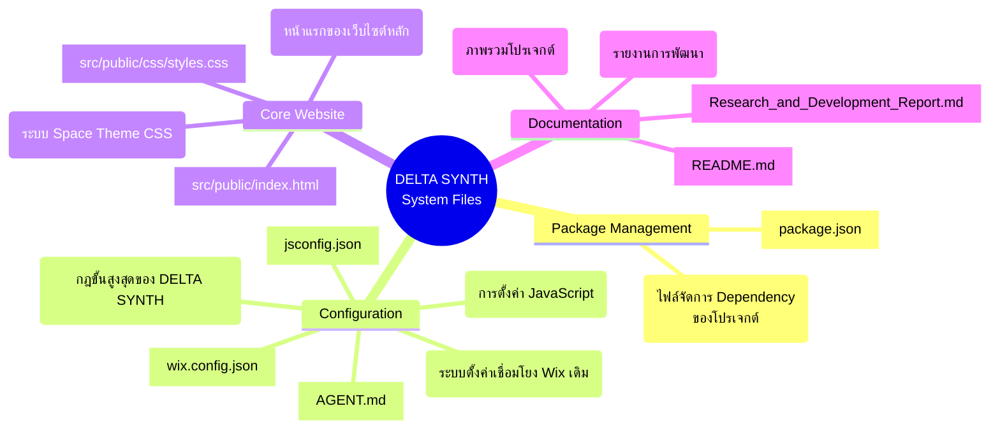

# The Source Code of System File's Name Mapping
> แผนผัง Mind Mapping แสดงชื่อไฟล์ระบบที่สำคัญที่สุดของโปรเจกต์ ห้ามถูกลบหรือแก้ไขโดยไม่จำเป็น

## สรุปคำอธิบายหน้าที่หลัก (Critical File Function Description)

1. **`AGENT.md`**: สำคัญที่สุด กฎกติกาของ AI Agent ในการรักษามาตรฐานการพัฒนา
2. **`package.json`**: เป็นหัวใจของโปรเจกต์ Vercel ที่กำหนด Build script และแพ็กเกจที่ระบบต้องการ
3. **`src/public/index.html`**: เป็นทางเข้าของหน้าเว็บหลัก (Entry Point) 
4. **`src/public/css/styles.css`**: คุมการแสดงผลระบบ Glassmorphism และ Space Theme ทั้งหมด
5. **`wix.config.json`**: ช่วยป้องกันไม่ให้โครงสร้างเดิมที่เชื่อมกับ Wix พัง (Legacy Configuration)
6. **`README.md`**: สมุดพกพกพาง่ายๆ ที่บอกภาพรวมว่างานนี้ทำเกี่ยวกับอะไร
